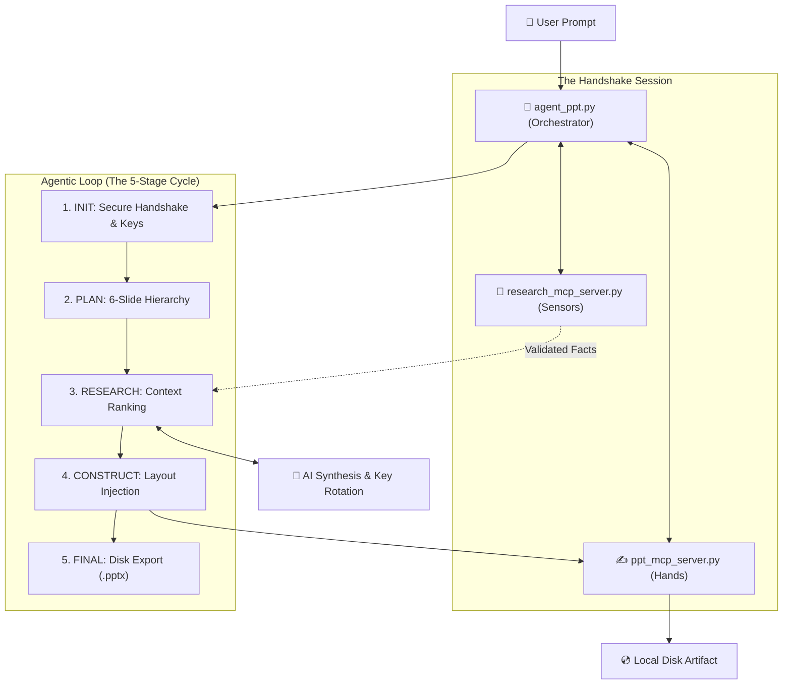

# 📜 Project: The "Auto-PPT" Agent - Technical Documentation
## **Autonomous Presentation Agent (Modular Implementation)**

**Developer:** YASASWINI  
**Course:** AI Agents & MCP Architecture  
**Objective:** To design and implement a functional, modular agent that coordinates multiple MCP servers to autonomously research and generate professional PowerPoint presentations based on a user's single-sentence prompt.

---

## 🚀 Project Overview
The "Auto-PPT" Agent is an agentic system that follows a structured loop to build scientifically accurate presentations. By leveraging the **Model Context Protocol (MCP)**, the system separates cognitive tasks (Research and Planning) from execution tasks (PowerPoint generation).

### **Key Technical Features:**
- **Dynamic Research Loop:** Uses the Research MCP server to fetch encyclopedia-grade facts from Wikipedia and safe-hallucination fallbacks from Dictionary APIs.
- **Agentic Slide Planning:** Before writing, the agent establishes a 6-slide thematic hierarchy (Taxonomy, Physiology, Lifecycle, etc.) to ensure logical narrative flow.
- **Modular Decoupling:** Separates the core agent brain from the tool servers, allowing for independent scaling and maintenance of research or design logic.
- **Professional Aesthetics:** Automatically applies a Midnight Navy and Gold theme with precise alignment and designer ribbons.

---

## 📂 Modular System Workflow: Visual Overview

---

## 📂 Modular System Workflow: Component Breakdown
The system architecture is distributed across three specialized files in the `Modular code/` directory:

### 1. `agent_ppt.py` (The Orchestrator / Brain)
- **Primary Role:** Manages the high-level logic, API fallbacks, and tool coordination.
- **Workflow:**
    - **Stage 1 (Initialization):** Handshakes with both MCP servers using async standard IO.
    - **Stage 2 (Planning):** Analyzes the user prompt and generates a scientific slide hierarchy.
    - **Stage 3 (Synthesis):** Iterates through slides, requesting filtered facts from the sensor and directing the construction of layouts.

### 2. `ppt_mcp_server.py` (The Design Engine / Hands)
- **Primary Role:** Handles all PowerPoint manipulation and visual formatting.
- **Workflow:**
    - Manages multi-session in-memory presentation states using `python-pptx`.
    - Implements professional layout templates with custom font styling and color-accurate themes.
    - Executes precise shape placement for bullet points and decorative UI elements.

### 3. `research_mcp_server.py` (The Research Engine / Senses)
- **Primary Role:** Queries external APIs for topic-specific scientific data.
- **Workflow:**
    - Sanitizes research queries to optimize Wikipedia search accuracy.
    - Ranks and filters sentences to ensure thematic relevance to specific slide headings.
    - Provides a redundancy layer using Dictionary APIs to ensure robustness if the primary source fails.

---

## 🛠️ Individual Tool Technical Reference

Each MCP server exposes specific tools that the Agent orchestrates in a logical sequence. Here is the technical breakdown:

### **Research Server Tools**
*   **`search_topic(query, slide_title)`**:
    *   **Usage**: The agent calls this for every slide.
    *   **Logic**: It converts the prompt into a Wikipedia-safe slug. It then ranks retrieved sentences based on their overlap with the `slide_title` to ensure "Taxonomy" facts don't end up on a "Lifecycle" slide.
    *   **Fallbacks**: If Wikipedia is unreachable, it automatically queries the Dictionary API for encyclopedic definitions.

### **PowerPoint Server Tools**
*   **`create_pptx(title)`**:
    *   **Usage**: Called during the **INIT** stage.
    *   **Logic**: Initializes an in-memory `Presentation` object and generates a unique `session_id`. It creates the title slide with the midnight-navy theme.
*   **`add_slide(session_id, slide_title, bullets)`**:
    *   **Usage**: Called iteratively for each of the 6 scientific slides.
    *   **Logic**: Injects the filtered bullets into a professional layout. It uses deterministic shape coordinates (the "Designer Ribbons") to ensure aesthetic consistency without human intervention.
*   **`save_presentation(session_id, output_path)`**:
    *   **Usage**: Final stage of the agentic loop.
    *   **Logic**: Flushes the in-memory slide data to the local disk at the specified path.

### **The Orchestration Flow (How they work together)**
1.  **Handshake**: `agent_ppt` calls `create_pptx` to get a `session_id`.
2.  **Information Retrieval**: For Slide 1, the agent sends the topic to `search_topic`.
3.  **Synthesis**: The agent passes the research results to the **LLM (with HF Key Rotation)** to refine them into 5 bullet points.
4.  **Construction**: The finalized bullets are sent to `add_slide`.
5.  **Persistence**: After Slide 6 is constructed, `save_presentation` is called to finalize the file.

---

---

## 🛠️ Assignment Technical Checklist
| Feature | Technical Implementation | Status |
| :--- | :--- | :--- |
| **MCP Integration** | Implemented using Stdio Transport across three modular servers. | ✅ Complete |
| **Agentic Loop** | Uses a 5-stage lifecycle (Plan-Research-Refine-Build-Finalize). | ✅ Complete |
| **Scientific Accuracy** | Subject-specific thematic keyword whitelist used for content validation. | ✅ Complete |
| **Content Redundancy** | Auto-fallback to Dictionary APIs if Wikipedia data is insufficient. | ✅ Complete |
| **System Robustness** | Automated API token rotation to handle rate-limits and availability. | ✅ Complete |

---

**Built by YASASWINI**
