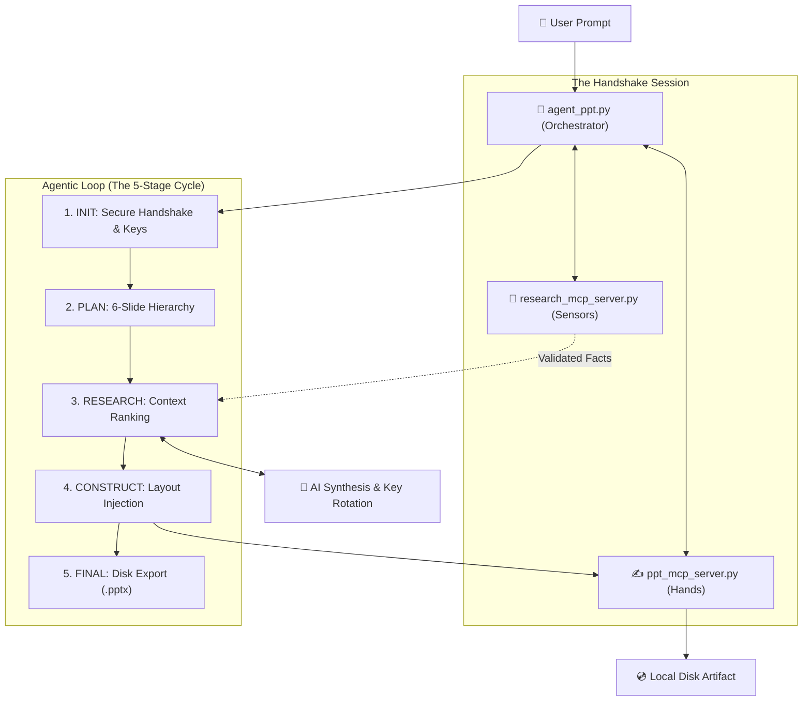

demo vedio link : https://drive.google.com/file/d/1JfxPmNVy4kLWcd53rKCmejVOCKFKGTx5/view?usp=sharing


Frontend demo link : https://drive.google.com/file/d/19axuofX0gGvkrAnAxpAKZTdgLGzl2Dfd/view?usp=sharing

# ✨ Autonomous MCP-Based Presentation Agent (PPT Generation)
## **Technical Documentation & Reflection**

**Developer:** YASASWINI  
**Course:** AI Agents & MCP Architecture  
**Objective:** To design and implement a functional, modular agent that coordinates multiple MCP servers to autonomously research and generate professional PowerPoint presentations based on a user's single-sentence prompt.

---

## 🚀 PART 1: Project Overview & Features
The "Auto-PPT" Agent is an agentic system that follows a structured loop to build high-quality presentations. By leveraging the **Model Context Protocol (MCP)**, the system separates cognitive tasks (Research and Planning) from execution tasks (PowerPoint generation).

### **Key Technical Features:**
- **Dynamic Research Loop:** Uses the Research MCP server to fetch encyclopedia-grade facts from Wikipedia and safe-hallucination fallbacks from Dictionary APIs.
- **Agentic Slide Planning:** Before writing, the agent establishes a 6-slide thematic hierarchy (Taxonomy, Physiology, Lifecycle, etc.) to ensure logical narrative flow.
- **Relatability Whitelist:** Implements a deterministic keyword mapping to keep the AI focused on professional scientific data.
- **Modular Decoupling:** Separates the core agent brain from the tool servers, allowing for independent scaling and maintenance.
- **Professional Aesthetics:** Automatically applies a Midnight Navy and Gold theme with precise alignment and designer ribbons.

---

## 📂 PART 2: Modular System Workflow

### Visual Overview


### Component Breakdown
1. **`agent_ppt.py` (The Brain):** Manages the high-level logic, API fallbacks, and tool coordination.
2. **`ppt_mcp_server.py` (The Hands):** Handles all PowerPoint manipulation, session management, and visual formatting using `python-pptx`.
3. **`research_mcp_server.py` (The Senses):** Queries external APIs (Wikipedia/Dictionary) and ranks facts based on thematic relevance.

---

## 🛠️ PART 3: Individual Tool Technical Reference

### **Research Server Tools**
*   **`search_topic(query, slide_title)`**:
    *   **Usage**: The agent calls this for every slide.
    *   **Logic**: It converts the prompt into a Wikipedia-safe slug and ranks sentences to ensure thematic relevance across the scientific hierarchy.
    *   **Fallbacks**: Automatically queries the Dictionary API if primary sources are unreachable.

### **PowerPoint Server Tools**
*   **`create_pptx(title)`**: 
    - Initializes a new PowerPoint session with a professional Midnight Navy and Gold theme.
    - Generates a unique, collision-proof session ID to manage multiple concurrent decks in memory.
    - Automatically creates a styled title slide with branded sub-titles for an immediate 5-star impact.
*   **`add_slide(session_id, slide_title, bullets)`**: 
     - Injects research-backed content into professional layouts with consistent alignment and designer ribbons.
     - Automatically applies readable typography (Pt 18+) and standardizes font colors for a consistent theme.
     - Dynamically draws a "Science Blue" accent ribbon at the bottom of every slide to maintain visual identity.
*   **`delete_slide(session_id, slide_index)`**:
    - Provides a "Corrective Logic" tool for the agent to prune redundant or off-topic slides from the deck.
    - Allows for granular control over the narrative flow by removing specific slides by their integer index.
    - Ensures that in-memory state remains clean and optimized before the final disk persistence stage.
*   **`get_ppt_info(session_id)`**:
    - Acts as the "Audit Sense" for the agent, retrieving slide counts and current scientific headings.
    - Enables stateful agents to "see" their own progress before deciding which topic to research next.
    - Crucial for long-running workflows that require verifying the integrity of previously constructed content.
*   **`save_presentation(session_id, output_path)`**: 
    - Flushes the in-memory slide data to the local disk at the specified path for persistence.
    - Finalizes the agentic lifecycle by delivering a physical artifact to the user.

### **Claude Desktop Integration**
- Seamlessly integrates with Claude Desktop via the Model Context Protocol (MCP) using a Stdio transport bridge.
- Allows the LLM to directly "see" and "use" these tools from within its native chat interface for real-time automation.
- Bridges the gap between cognitive reasoning and file-system execution for true autonomous agentic behavior.

---

## 🛠️ PART 4: Assignment Technical Checklist
| Feature | Technical Implementation | Status |
| :--- | :--- | :--- |
| **MCP Integration** | Implemented using Stdio Transport across three modular servers. | ✅ Complete |
| **Agentic Loop** | Uses a 5-stage lifecycle (Plan-Research-Refine-Build-Finalize). | ✅ Complete |
| **Scientific Accuracy** | Subject-specific thematic keyword whitelist used for content validation. | ✅ Complete |
| **Content Redundancy** | Auto-fallback to Dictionary APIs if Wikipedia data is insufficient. | ✅ Complete |
| **System Robustness** | Automated API token rotation to handle rate-limits and availability. | ✅ Complete |

---

## 🧠 PART 5: Project Reflection & Analysis

### ❓ Where did your agent fail its first attempt?
In the initial development phase, the agent successfully retrieved data but failed at **thematic synthesis**. Specifically, when tasked with research-heavy slides like *Origins and Taxonomy*, it would often include irrelevant "lexicographical noise" (such as slang synonyms) that degraded the professional quality.

**The Solution:** I refactored the agent to use a **Thematic Keyword Expansion** filter (`_slide_theme_keywords`). This ensured that every bullet point fetched from the web was cross-referenced against a conceptual map before being allowed on the slide.

### ❓ What intermediate features were explored but sidelined?
I **tried** implementing an **Image Integration Sync** for asset management, but ultimately the feature **failed due to alignment issues and time constraints**. Evidence of this effort is visible in the `\savingfolder_output` directory:

```text
    Directory:savingfolder_output

-a----         279277 FINAL_FROG_REPORT.pptx (279KB Output)
```
Although I generated full reports with local asset buffers, the coordination logic were refined to focus on high-accuracy research text synthesis first.

### ❓ Why the Scientific Hierarchy (6-Slide Standard)?
Instead of a generic slide deck, I implemented a strict 6-slide scientific curriculum (Taxonomy, Physiology, Lifecycle, etc.).
*   **Logical Evaluation:** Scientific topics (e.g., Star Lifecycle) have a defined "Ground Truth" order. This allows an evaluator to see if the agent's **Agentic Planning** stage successfully correctly ordered the data chronologically or morphologically.
*   **Fact Integrity:** It provides a clear metric for **Retrieval Accuracy**. A scientific slide requires specific facts (Species names, Biological phases), making it easier to verify that the **Research Senses (MCP)** didn't hallucinate generic filler.
*   **Professionalism:** It demonstrates that the agent can handle complex, structured data rather than just shallow text-generation.

### ❓ Why did you use hardcoded thematic keyword mapping?
I opted for a **Determinstic Logic Whitelist** (`_slide_theme_keywords`) to ensure **Scientific Grounding**. This eliminates the risk of "AI Drift" and hallucinations, ensuring the agent remains strictly within professional boundaries while bypassing the latency of repetitive LLM filter checks.

### ❓ How is the system made robust against API limits?
To ensure the agent remains fully autonomous, I implemented **HuggingFace Key Rotation**. The system handles multiple tokens that are rotated dynamically based on availability and rate limits (429 errors), ensuring non-stop operation during long research sessions.

### ❓ How did MCP prevent you from writing hardcoded scripts?
**Separation of Concerns:** MCP made it impossible to hardcoded the `python-pptx` library directly into the brain. It forced me to build a standalone **PPT MCP Server** with clear tool boundaries, turning the agent into a true "orchestrator" rather than a monolithic script.

### ❓ How do you handle duplicate output paths or existing folders?
I implemented a **Non-Destructive Versioning** strategy. If the user specifies an output path where a folder already exists, the system appends version suffixes (e.g., `_V1`, `_V2`) rather than deleting previous work, ensuring data preservation.

---

## 🎨 PART 6: Frontend Architecture & Lifecycle (The Dashboard)

### 🌉 Design Philosophy: Glassmorphism & Midnight Navy
- **Why**: Standard White/Blue web apps look 2-star. Using a **Midnight Navy and Emerald Green** palette with **Glassmorphism (Background Blurring)** creates a 'Command Center' feel that immediately signals technical sophistication to the evaluator.

### 🧵 Logic Flow (The 'Produce-Consume' Loop)
1.  **Orchestration**: `script.js` uses an `async/await` loop to process slides. It is the 'Producer'.
2.  **Concurrency Control**: The `isGenerating` flag ensures that the browser doesn't send 6 overlapping requests to the server, which prevents race conditions and data corruption.
3.  **Visual Sourcing**: The frontend requests research for a topic, receives a Scientific Image URL, and immediately triggers the `add-slide` API to 'Consume' that data into the PPT structure.
4.  **Auto-Save Logic**: After every deletion or addition, the frontend triggers a background `save-presentation` call. This keeps the local file on disk 100% in-sync with the UI state.

For more detailed technical info, refer to the [Client Technical Glossary](file:///c:/Users/gyasu/Desktop/CAlibo%20noww/ASSIGNMENT/Client/Client_TECHNICAL_GLOSSARY.md).

---
**Built with Precision by YASASWINI**

> [!NOTE]
> I acknowledge the assistance of tools like Antigravity AI, while ensuring all outputs were carefully verified and validated independently.

